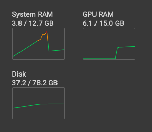

# Seamlessly
Colab Notebook for SeamlessM4T model by Meta

Notebook with sharing URL enabled is here https://colab.research.google.com/drive/1IpxSWgwbEJv9DDftmXEG3VvpSn8zqDyQ?usp=sharing 

Needs ~6.xGB VRAM to run on the T4(16GB)

Thanks to HF/Vaibhav for setting up https://huggingface.co/spaces/facebook/seamless_m4t on HF.

Please ensure you change the runtime to GPU/T4 before running the notebook

## UI/Resources Consumed

